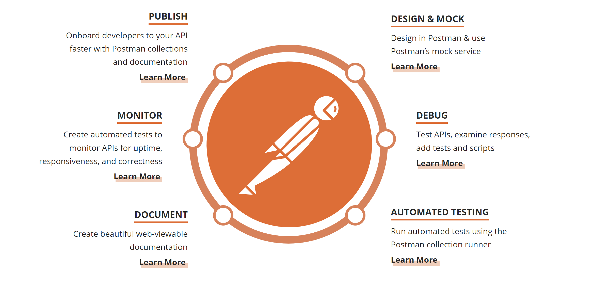

# 1

A **mock server** is a fake API that can simulate server responses without having to completely set up endpoints in the **backend** beforehand.

Now, why would someone use a mock server? Mock servers allow developers to see the what kind of responses they receive in order to further develop their new endpoints to display the desired behavior, and Postman offers the option to create either public or private servers, with which users can control who has permission to access and edit the collection.

Mock servers are often used towards the beginning of the API development process, as can be seen in the API Lifestyle diagram posted on the Postman website.

Let's envision an API Development team—how would different team members use mock servers during this process?

When a team starts designing an API, product mangers and API designers could use mock servers to specify the desired behavior for new end points. Then, front-end and back-end developers can continue developing with these specifications in mind, and testers can start creating tests for the API.

Overall, mock servers are very helpful in the API development process because examining the responses an API displays early on will allow for users to develop in correspondence to the expected behavior they are working towards, preventing possible future delays and allowing for a more efficient workflow!

