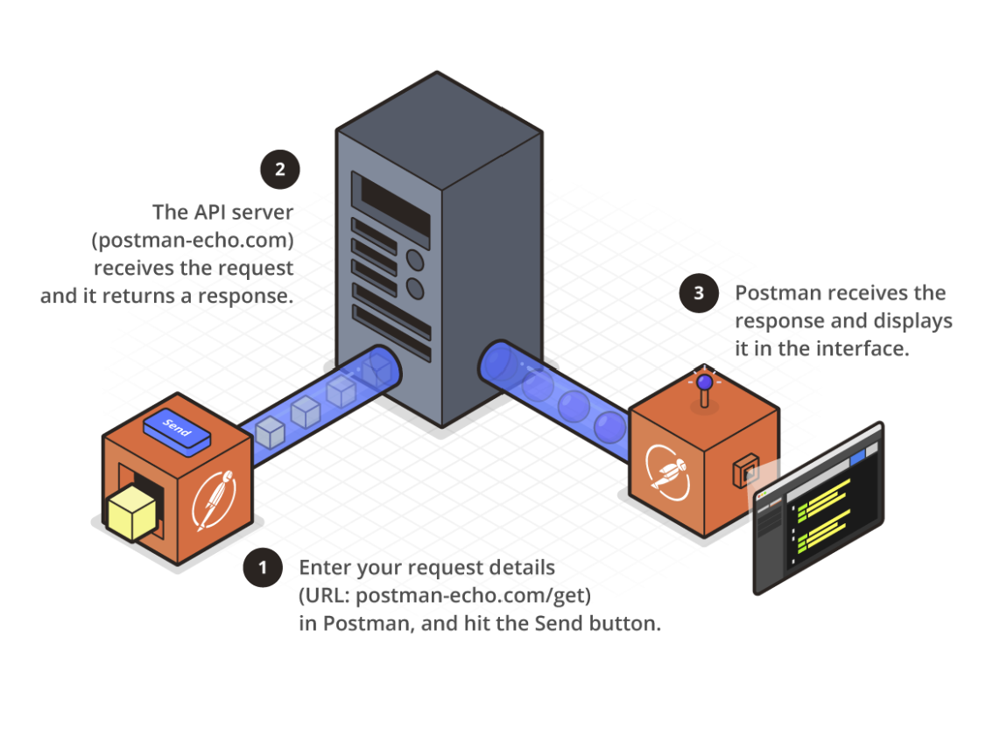
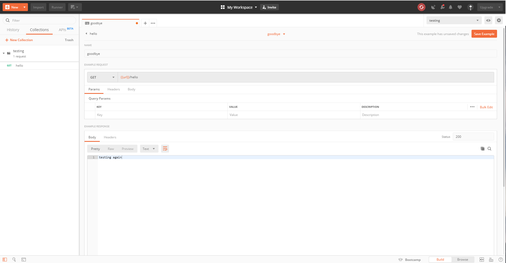

# 3

After setting up your mock server, you will start working in Postman Echo!

The **Postman Echo** service allows users to experiment with various responses and, first and foremost, can be used to generate example responses, which we will focus on in this lesson. In order to mock requests properly, we need to know how to generate examples for the mock server to "learn" from.

To continue from where we left off from the last lesson, go to the upper right-hand side of your window to, under the gear icon click on "Examples" and choose "Default". You can name your example and change your headers, body, status code, and example response body, which is specifically what we will be changing in the photo below.

Then, you should save your work by clicking "Save Example" in the upper right-hand corner before you click back to the mock server page. When you hit "Send" again, you can see what changes have been made, and in this case, the text below should be updated to what we had in the example response!

You have created your first sample response in your mock server! Now let's learn more about simulating API calls in Postman Echo.

