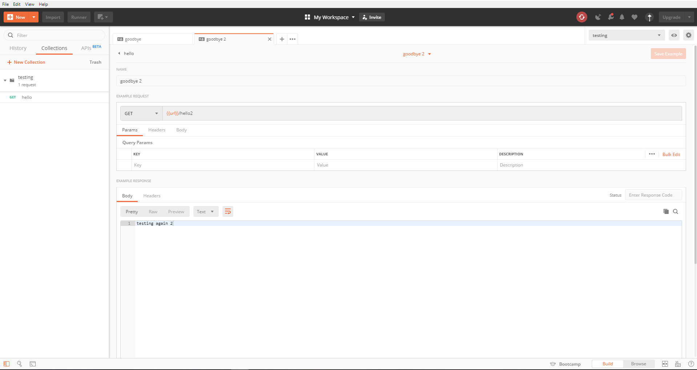
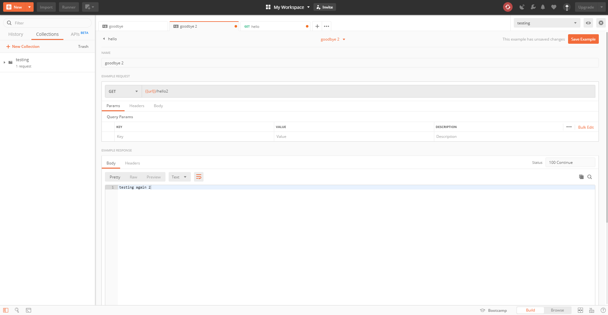

# 4

In addition to generating examples, users can simulate API calls on their mock server through Postman Echo by saving examples with a certain URL and method types and then making API calls to create expected responses.

Let's say that you wanted to an another example with a different type of response. In order to do this, go back to "Examples"—you should also be able to see the first example you made in here—and click on "Add Example".

You can name your example and change your response body as you did with the example in the prior lesson, but this time, you should also change the path name of the server as you can see in the photo below. This will allow you to send a request to different examples through the path name in the URL, so when you save and send a request to this URL, you should be able to see what you wrote in your second example below!

If we wanted a different corresponding status with a certain response, then we could go back to one of our examples and the "Status" of its response—this will generate a a different expected response. You can see in the photo below that our example's status is now labelled when it was not specified below!

To review, you can save and retrieve your mock responses through the path name, and to edit the generated response, you can update an example by changing the status code. Now, you know how to use your mock server in Postman!

