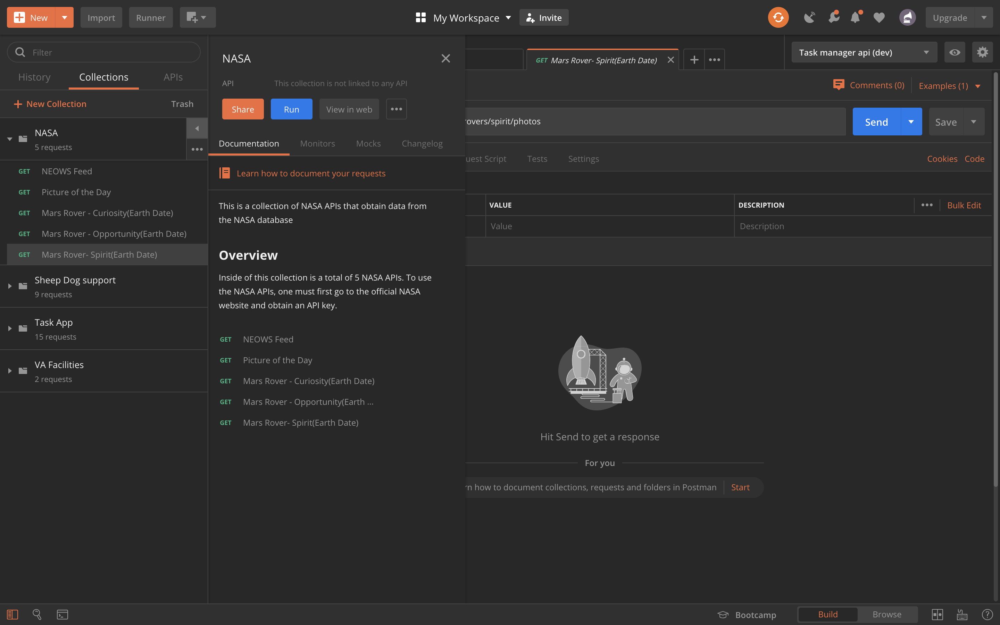
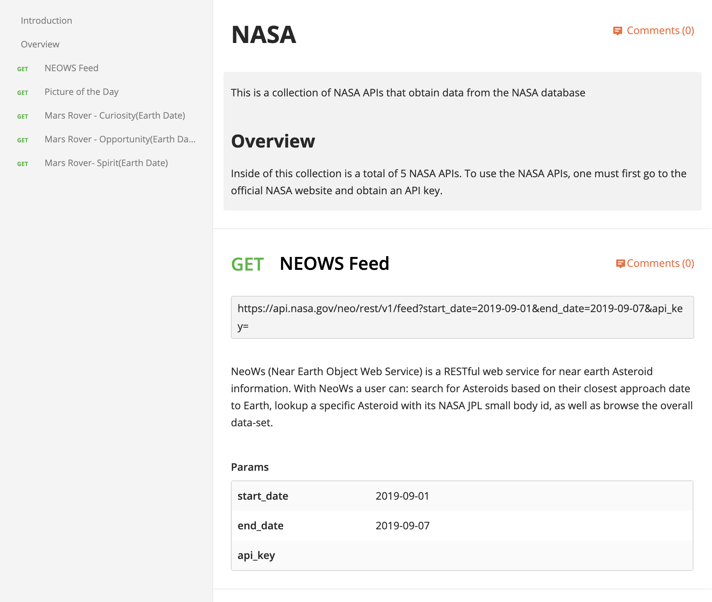
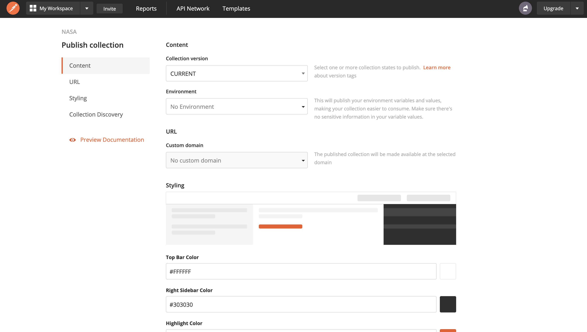

# 7

Now that we have finally finished creating our API documentation, we can head on over to the postman website and check and see what our it looks like. To do so, simply click on the arrow button next to our collection name and click the view in web button.

This should link you to the following API documentation we made:

It looks nice doesn't it! However, we are not quite done yet. Despite how beautiful our API documentation looks like, it'll be pointless if no one can see it. Therefore, as the last step, click on the publish button on the top right of our API documentation. Once you do that, you should see the following screen:

At the very bottom of that page lies another publish button that you have to click. Once you do so, your API documentation will be visible for all to see and marvel at!

Also Postman allows us to edit our documentation in the browser. Clicking on a section of the documentation will allow you to do it.

